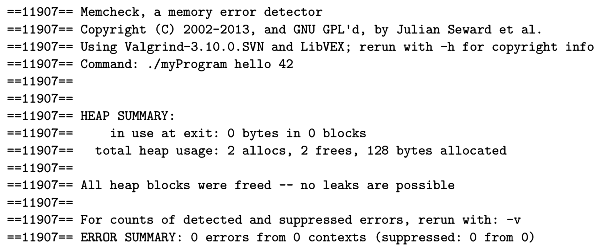
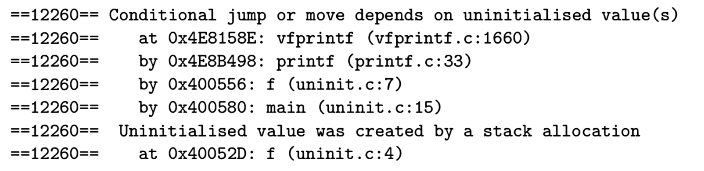
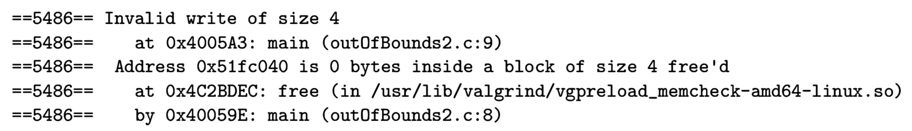

---
layout: post
title:  "Emacs, Makefile and Valrgrind"
date:   2019-09-02
categories: Coding
tag: Editor
---

* content
{:toc}

## Emacs 快捷键

&emsp;&emsp;最近由于课程要求，不得不开始学习Emacs的使用，开个博客记录一下Emacs痛苦的入门之路，简单记录一下常用的快捷键。持续更新ing...

注：关于Emacs和Vim的区别，[这里](https://mp.weixin.qq.com/s/KTaEuy7kfm7t1bwQmvE32Q)有一篇很好的文章

|                            Command                            | Shortcut |
|:-------------------------------------------------------------:|:--------:|
| Open("visit") file                                            | C-x C-f  |
| Save current buffer(an open file)                             | C-x C-s  |
| Save as [another name]                                        | C-x C-w  |
| Quit Emacs                                                    | C-x C-c  |
| Suspend Emacs                                                 | C-z      |
| Resume Emacs(when it is suspended)                            | fg       |
| Undo                                                          | C-_      |
| Set mark(then you can select a region text using your cursor) | C-@      |
| Cut(Kill)                                                     | C-w      |
| Copy                                                          | M-w      |
| Paste                                                         | C-y      |
| Page down(up)                                                 | C-v(M-v) |

搜索的功能相信是很多人日常的需求，Emacs当中，我们可以使用内置的isearch进行搜索：

|                    Command                    |                       Shortcut                       |
|:---------------------------------------------:|:----------------------------------------------------:|
| Enter isearch mode                            | M-x isearch-forward (then you can enter the keyword) |
| Jump to next occurrence                       |                          C-s                         |
| Jump to previous occurrence                   |                          C-r                         |
| Exit and place the cursor at origin position  |                          C-g                         |
| Exit and place the cursor at current position |                         Enter                        |

## Valgrind 简介

valgrind实际上是一系列工具的集合，在这里我们主要关注其中的**内存检查**工具，可以让我们检查程序是否存在内存泄露的问题（如：malloc分配了内存但是没有free，空指针...）

**如何使用？**

简单的使用valgrind指令来运行你的程序就好`valgrind ./myProgram hello 42`

**期待输出**

如果你使用valgrind运行你的程序，你应该期待得到以下的输出：



* All heap blocks were freed -- no leaks are possible（没有内存泄漏，所有空间都已正确释放）
* ERROR SUMMARY: 0 errors from 0 contexts（程序没有错误）

**常见错误**



* 有时候你会（不经意间）使用到一些未初始化的变量(尤其是你使用`malloc`的时候， 如`char * str = malloc(cnt * sizeof(* str))`，这会使得你得到的指针指向一个未初始化的内存，相应的你应该使用 `calloc`, `char * str = calloc(cnt * sizeof(* str))`)



* 有时候你会（不经意间）访问到一下不应该访问的内存（常由于数组越界导致）

```C
char * str1 = "Hello World";
char * str2 = calloc(cnt * sizeof(* str2));
strcpy(str2, str1);
```

注意 `strcpy` 会在字符串的结尾自动添加 `\0` ， 所以分配内存的时候，你需要为结束符多分配一个内存空间

**常用指令**

```shell
valgrind --track-origins=yes --leak-check=full ./myProgram
```

* `--track-origins=yes` 告诉valgrind显示导致每一个错误发生的具体代码位置
* `--leak-check=full` 告诉valgrind显示每一个内存泄漏的具体信息（由什么导致，在哪里发生）

## MakeFile 简介

在 C 里面，我们使用 `gcc` 进行编译

```make
CFLAGS=-std=gnu99 -pedantic -Wall -Werror -ggdb3
all: main.o
	gcc -o rand_story $(CFLAGS) main.o
main.o: main.c catarray.h
	gcc -c $(CFLAGS) main.c

.PHONY: clean
clean:
	rm -r rand_story *.o *~
```

在 C++ 里面，我们使用 `g++` 进行编译

```make
CFLAGS= -pedantic -Wall -Werror -ggdb3
all: code.o
        g++ -o code_output $(CFLAGS) code.o
code.o: code.cpp
        g++ -c $(CFLAGS) code.cpp

.PHONY: clean
clean:
        rm -r code_output *.o *~
```